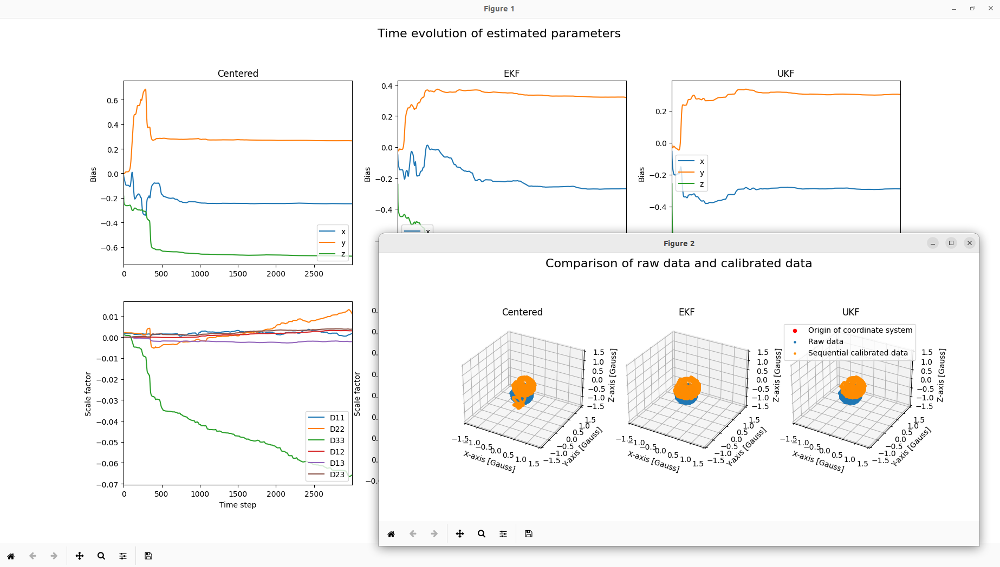

# 地磁気センサの逐次較正アルゴリズム

宇宙電波実験室の記事内で紹介したプログラムです（記事中では使用していません）。
3軸地磁気センサのバイアス・スケールファクタ・非直交性補正係数を推定します。

当該記事：[地磁気センサの逐次較正（宇宙電波実験室）](https://space-denpa.jp/2024/01/18/magnetmeter-sequential-calibration/)

## 原著論文

1. John L. Crassdis, Kok-Lam Lai, Richard R. Harman, “Real-Time Attitude-Independent Three-Axis Magnetometer Calibration”, Journal of Guidance, Control, and Dynamics, Vol.28, No.1, 2005.

## 実行方法

```
$ git clone https://github.com/HamaguRe/space-denpa_sequential_mag_calibration_full
$ cd space-denpa_sequential_mag_calibration_full
$ cargo run --release && python3 data_plot.py
```

## 実行結果


